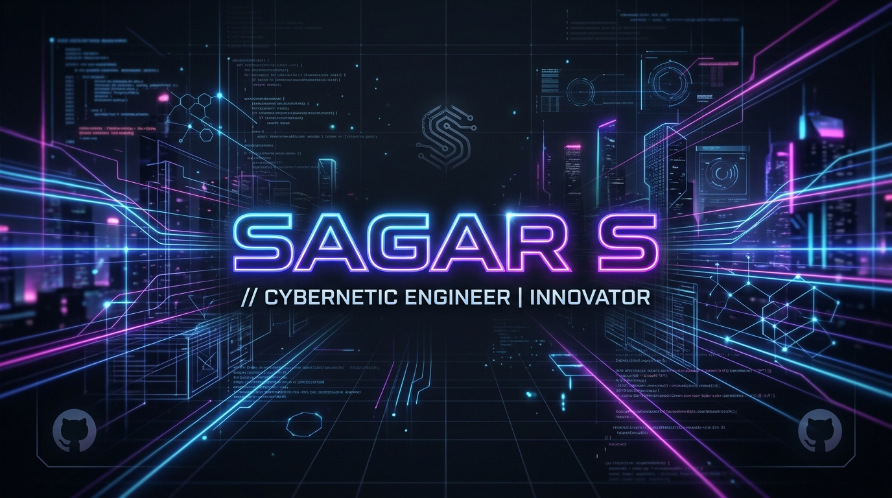

  

 

  

 

- 🎓 **Computer Science & Engineering Student** continuously exploring cutting-edge technology.
- 🏆 **Hackathon Enthusiast:** Passionate about building rapid solutions for real-world problems.
- 🥇 **Achievement:** Won **2nd Place** at the prestigious **Srishti Hackathon, Dharwad**!
- 🔭 **Interests:** Deeply interested in Full-Stack Web Development, Artificial Intelligence, and Cloud/DevOps.
- 🏸 **Hobbies:** When I'm not coding, you can find me playing **Badminton** or trying out new project ideas.

 

### 🚀 Programming Languages & Frameworks

  

### 💾 Databases & Systems

  

### 🧠 AI, ML & Tools

  

 

<table>
  <thead>
    <tr>
      <th>Project Name</th>
      <th>Description</th>
      <th>Tech Stack</th>
    </tr>
  </thead>
  <tbody>
    <tr>
      <td>🤖 <b>NeuroInsight AI</b></td>
      <td>State-of-the-art computer vision platform designed for real-time object detection and NLP analysis. Built for scale.</td>
      <td>
        
        
        
      </td>
    </tr>
    <tr>
      <td>🌐 <b>Nova Portal</b></td>
      <td>An ultra-responsive Next.js full-stack web application featuring realtime websocket dashboard synchronization and Redis caching.</td>
      <td>
        
        
        
        
      </td>
    </tr>
    <tr>
      <td>🏆 <b>Srishti Hackathon Project</b></td>
      <td>An innovative prototype solution designed and built under 36 hours, securing 2nd place among competing teams in Dharwad.</td>
      <td>
        
        
        
      </td>
    </tr>
  </tbody>
</table>

 

  
  &nbsp;&nbsp;
  

 

  

 

  
💡 <i>"The best way to predict the future is to invent it."</i>

