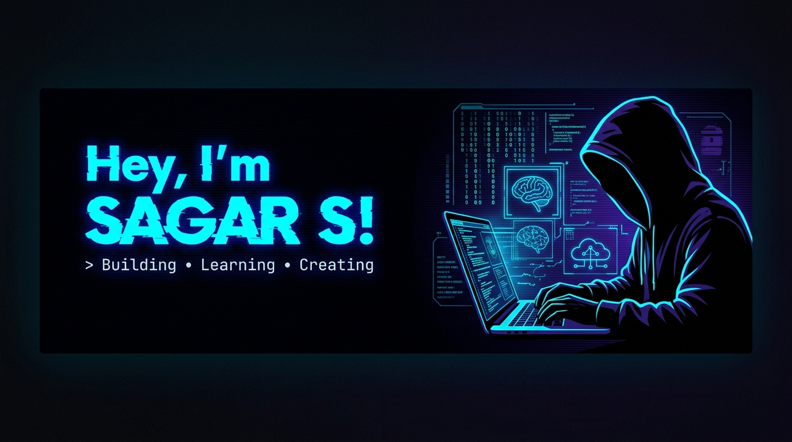
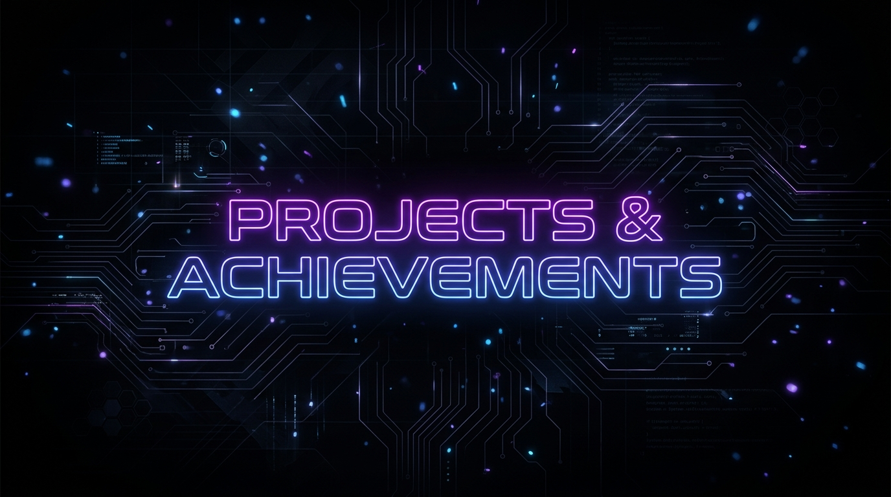

  

 

  

 

- 🎓 **Computer Science & Engineering Student** continuously exploring cutting-edge technology.
- 🏆 **Hackathon Enthusiast:** Passionate about building rapid solutions for real-world problems.
- 🥇 **Achievements:**
  - Won **1st Place** at the **Smart Agro Hackathon** organized by **ComedKares**!
  - Won **2nd Place** at the prestigious **Srishti Hackathon, Dharwad**!
- 🔭 **Interests:** Deeply interested in Full-Stack Web Development, Artificial Intelligence, IoT & Embedded Systems, and Cloud/DevOps.
- 🏸 **Hobbies:** When I'm not coding, you can find me playing **Badminton** or trying out new project ideas.

 

### 🎨 Front-End Development

  

### ⚙️ Back-End Development & Languages

  

### 📱 Mobile App Development

  

### 🤖 Machine Learning & AI

  

### 🗄️ Databases & Backend-as-a-Service (BaaS)

  

### 🔑 Authentication & Security

  
  &nbsp;
  
  &nbsp;
  

### 🛠️ DevOps, Hosting & Tools

  
   
  

### 🔌 IoT & Embedded Systems

  
   
  

 

<table>
  <thead>
    <tr>
      <th>Project Name</th>
      <th>Description</th>
      <th>Tech Stack</th>
    </tr>
  </thead>
  <tbody>
    <tr>
      <td>🛡️ <b><a href="https://github.com/Sagarspoojary/AI-Powered-PII-Detection-and-Masking">AI PII Detection & Masking</a></b></td>
      <td>Smart security application powered by AI models to identify and dynamically redact personally identifiable information.</td>
      <td>
        
        
        
        
      </td>
    </tr>
    <tr>
      <td>🧬 <b><a href="https://github.com/Sagarspoojary/AI-Blockchain-Genetic-Health-Twin">Genetic Health Twin</a></b></td>
      <td>A secure, decentralized medical logging prototype combining blockchain tracking and predictive genomic AI models.</td>
      <td>
        
        
        
      </td>
    </tr>
    <tr>
      <td>📈 <b><a href="https://github.com/Sagarspoojary/AlgoVision">AlgoVision</a></b></td>
      <td>An interactive visualization tool mapping data structures and sorting/searching algorithms step-by-step.</td>
      <td>
        
        
        
      </td>
    </tr>
    <tr>
      <td>🏆 <b><a href="https://github.com/Sagarspoojary/CyberShield-Ai">CyberShield-Ai</a></b></td>
      <td>Machine learning network classifier and intrusion defense mechanism. Developed as part of state-level hackathon work.</td>
      <td>
        
        
        
      </td>
    </tr>
    <tr>
      <td>🏫 <b><a href="https://github.com/Sagarspoojary/University-management-system">University Management System</a></b></td>
      <td>A comprehensive college/university administration database and management desktop system.</td>
      <td>
        
      </td>
    </tr>
    <tr>
      <td>📱 <b><a href="https://github.com/Sagarspoojary/Recipto">Recipto</a></b></td>
      <td>A handy receipt capturing, parsing, and budget management mobile application.</td>
      <td>
        
      </td>
    </tr>
    <tr>
      <td>🧘 <b><a href="https://github.com/Sagarspoojary/StressCare">StressCare</a></b></td>
      <td>A wellness-tracking mobile application designed to help monitor and manage daily mental health levels.</td>
      <td>
        
      </td>
    </tr>
    <tr>
      <td>🏨 <b><a href="https://github.com/Sagarspoojary/DBMS-PROJECT-HOTEL-MANAGEMENT-SYSTEM-">Hotel Management System</a></b></td>
      <td>A booking portal and administrative database system for hotels, backed by MySQL.</td>
      <td>
        
        
        
        
      </td>
    </tr>
  </tbody>
</table>

> 💡 **Looking for more?** I also have several smaller academic projects, coding challenges, script files, and utilities hosted on my [GitHub repositories page](https://github.com/Sagarspoojary?tab=repositories). Feel free to explore!

 

  
  &nbsp;&nbsp;
  
  &nbsp;&nbsp;
  

 

  
    
  

 

  
💡 <i>"The best way to predict the future is to invent it."</i>

